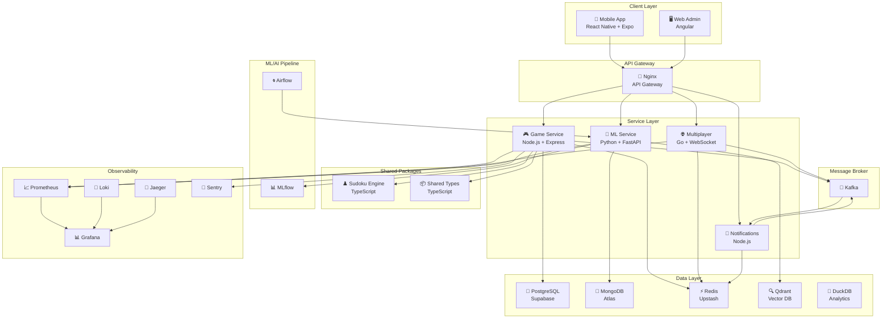

# 🧩 Sudoku Ultra

**ML-Powered Sudoku Platform** — A production-grade, microservices-based mobile Sudoku app with ML difficulty classification, real-time multiplayer, CV puzzle scanning, and an AI technique tutor.


---

## Architecture



---

## Tech Stack

| Layer | Technology |
|-------|-----------|
| **Mobile** | React Native, Expo, TypeScript, NativeWind, Zustand, React Navigation |
| **Game Service** | Node.js, Express, TypeScript, Prisma |
| **Multiplayer** | Go, gorilla/websocket |
| **ML/AI** | Python, FastAPI, PyTorch, scikit-learn, LangChain |
| **Notifications** | Node.js, Express |
| **Databases** | PostgreSQL (Supabase), MongoDB (Atlas), Redis (Upstash), Qdrant, DuckDB |
| **Monorepo** | Turborepo |
| **CI/CD** | GitHub Actions, GHCR |
| **Containers** | Docker, Docker Compose (local), k3s (prod) |
| **Observability** | Prometheus, Grafana, Loki, Jaeger, Sentry |
| **IaC** | Terraform, Helm, ArgoCD |
| **Auth** | JWT + Refresh Tokens + OAuth2 (Google/Apple) |

---

## Monorepo Structure

```
sudoku-ultra/
├── apps/
│   ├── mobile/              # React Native (Expo)
│   └── web-admin/           # Angular admin dashboard
├── services/
│   ├── game-service/        # Node.js + Express + Prisma
│   ├── multiplayer/         # Go + WebSocket
│   ├── ml-service/          # Python + FastAPI
│   └── notifications/       # Node.js + Express
├── packages/
│   ├── shared-types/        # Shared TypeScript type definitions
│   └── sudoku-engine/       # Core puzzle logic (TypeScript)
├── infra/
│   ├── docker-compose.yml   # Local dev environment
│   ├── terraform/           # Infrastructure as Code
│   └── k8s/                 # Helm charts
├── ml/
│   ├── models/              # Trained model artifacts
│   ├── notebooks/           # Jupyter notebooks
│   └── pipelines/           # Airflow DAGs
├── .github/
│   └── workflows/           # GitHub Actions CI/CD
└── docs/
    └── architecture/        # Architecture decision records
```

---

## Getting Started

### Prerequisites

- **Node.js** >= 18.0.0
- **npm** >= 10.0.0
- **Go** >= 1.22
- **Python** >= 3.11
- **Docker** & **Docker Compose**

### Setup

```bash
# 1. Clone the repository
git clone https://github.com/your-org/sudoku-ultra.git
cd sudoku-ultra

# 2. Install dependencies
npm install

# 3. Build all packages
npx turbo build

# 4. Start the local development environment
npx turbo dev

# 5. Start infrastructure (databases)
cd infra && docker compose up -d
```

### Common Commands

| Command | Description |
|---------|-------------|
| `npm run build` | Build all packages and services |
| `npm run dev` | Start all services in dev mode |
| `npm run lint` | Lint all TypeScript packages |
| `npm run test` | Run all test suites |
| `npm run format` | Format all files with Prettier |
| `npx turbo build --filter=@sudoku-ultra/game-service` | Build a specific workspace |

---

## Development Phases

| Phase | Focus | Status |
|-------|-------|--------|
| **Phase 1** | Foundation — Monorepo, Engine, Game Service, Mobile App, CI/CD | 🔧 In Progress |
| **Phase 2** | Multiplayer — WebSocket rooms, matchmaking, in-game chat | ⏳ Planned |
| **Phase 3** | ML/AI — Difficulty classifier, CV scanner, RAG tutor, RL bot | ⏳ Planned |
| **Phase 4** | Polish — Gamification, onboarding, edge AI, observability | ⏳ Planned |
| **Phase 5** | Production — k3s deployment, IaC, GitOps, load testing | ⏳ Planned |

---

## License

MIT © Sudoku Ultra Team
