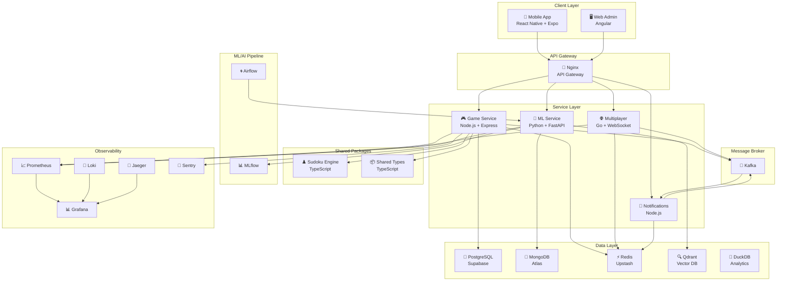

# 🧩 Sudoku Ultra

**ML-Powered Sudoku Platform** — A production-grade, microservices-based mobile Sudoku app with ML difficulty classification, real-time multiplayer, CV puzzle scanning, and an AI technique tutor.


---

## Architecture



---

## Tech Stack

| Layer | Technology |
|-------|-----------|
| **Mobile** | React Native, Expo, TypeScript, NativeWind, Zustand, React Navigation, EAS |
| **Game Service** | Node.js, Express, TypeScript, Prisma |
| **Multiplayer** | Go, gorilla/websocket |
| **ML/AI** | Python, FastAPI, PyTorch, scikit-learn, LangChain, MLflow, Evidently |
| **Edge AI** | ONNX Runtime (React Native), TFLite (scanner) |
| **Notifications** | Node.js, Express |
| **Databases** | PostgreSQL, MongoDB, Redis, Qdrant, DuckDB |
| **Monorepo** | Turborepo |
| **CI/CD** | GitHub Actions, GHCR, CodeQL, Trivy |
| **Containers** | Docker, Docker Compose (local), Kubernetes (prod) |
| **Observability** | OpenTelemetry, Prometheus, Grafana, Loki, Jaeger, Sentry |
| **IaC** | Terraform, Helm, ArgoCD, HashiCorp Vault |
| **Auth** | JWT + Refresh Tokens + OAuth2 (Google/Apple) |
| **Security** | Helmet, express-rate-limit, NetworkPolicy, RBAC, pod securityContext |
| **Load testing** | k6 (7 test scripts, nightly regression gate) |

---

## Monorepo Structure

```
sudoku-ultra/
├── apps/
│   ├── mobile/              # React Native (Expo) — iOS + Android
│   └── web-admin/           # Angular admin dashboard
├── services/
│   ├── game-service/        # Node.js + Express + Prisma
│   ├── multiplayer/         # Go + WebSocket
│   ├── ml-service/          # Python + FastAPI
│   └── notifications/       # Node.js + Express
├── packages/
│   ├── shared-types/        # Shared TypeScript type definitions
│   └── sudoku-engine/       # Core puzzle logic (TypeScript)
├── infra/
│   ├── docker-compose.yml   # Local dev environment
│   ├── terraform/           # AWS infrastructure (EKS, RDS, ElastiCache)
│   ├── helm/                # Helm chart (all k8s manifests)
│   ├── argocd/              # ArgoCD GitOps manifests
│   ├── backup/              # PostgreSQL + MongoDB backup scripts
│   └── otel-collector/      # OpenTelemetry Collector config
├── k6/
│   ├── config.js            # Shared k6 options + env helpers
│   └── scripts/             # Load test scripts (7 scenarios)
├── ml/
│   ├── models/              # Trained model artifacts
│   ├── notebooks/           # Jupyter exploration notebooks
│   └── pipelines/           # Airflow DAGs
├── .github/
│   └── workflows/           # CI, security, nightly, release pipelines
└── docs/
    ├── architecture/        # Architecture decision records (phases 4 + 5)
    ├── api/                 # API endpoint documentation
    ├── deployment/          # Deployment guides, DR runbook, performance budget
    ├── mlops/               # ML model runbooks + SLAs
    ├── operations/          # On-call runbook
    └── development/         # Contributing guide, local setup
```

---

## Getting Started

### Prerequisites

- **Node.js** >= 18.0.0
- **npm** >= 10.0.0
- **Go** >= 1.22
- **Python** >= 3.11
- **Docker** & **Docker Compose**

### Setup

```bash
# 1. Clone the repository
git clone https://github.com/your-org/sudoku-ultra.git
cd sudoku-ultra

# 2. Install dependencies
npm install

# 3. Build all packages
npx turbo build

# 4. Start the local development environment
npx turbo dev

# 5. Start infrastructure (databases)
cd infra && docker compose up -d
```

### Common Commands

| Command | Description |
|---------|-------------|
| `npm run build` | Build all packages and services |
| `npm run dev` | Start all services in dev mode |
| `npm run lint` | Lint all TypeScript packages |
| `npm run test` | Run all test suites |
| `npm run format` | Format all files with Prettier |
| `npx turbo build --filter=@sudoku-ultra/game-service` | Build a specific workspace |
| `k6 run k6/scripts/smoke.js` | Run smoke load test against localhost |
| `npx turbo test:coverage` | Run tests with coverage report |

See [Contributing Guide](docs/development/contributing.md) for full local setup instructions.

---

## Development Phases

| Phase | Focus | Status |
|-------|-------|--------|
| **Phase 1** | Foundation — Monorepo, Engine, Game Service, Mobile App, CI/CD | ✅ Complete |
| **Phase 2** | Multiplayer — WebSocket rooms, matchmaking, in-game chat | ✅ Complete |
| **Phase 3** | ML/AI — Difficulty classifier, CV scanner, RAG tutor, RL bot | ✅ Complete |
| **Phase 4** | Polish — Gamification, onboarding, edge AI, observability | ✅ Complete |
| **Phase 5** | Platform Maturity — Security, IaC, GitOps, load testing, mobile release | ✅ Complete |

## Documentation

| Document | Description |
|---|---|
| [Contributing](docs/development/contributing.md) | Local setup, testing, code standards, PR process |
| [Phase 5 Architecture](docs/architecture/phase5.md) | Full production architecture (all 10 deliverables) |
| [On-Call Runbook](docs/operations/on-call-runbook.md) | Alert → runbook mapping, incident response |
| [Disaster Recovery](docs/deployment/disaster-recovery.md) | RTO 4h / RPO 24h restore procedures |
| [Performance Budget](docs/deployment/performance-budget.md) | SLO tables, k6 baselines, regression gate |
| [Helm + Terraform + ArgoCD](docs/deployment/helm-terraform-argocd.md) | Deployment guide |
| [Model Runbook](docs/mlops/model-runbook.md) | ML model update + rollback procedures |
| [MLOps SLA](docs/mlops/sla.md) | ML service commitments |

---

## License

MIT © Sudoku Ultra Team
